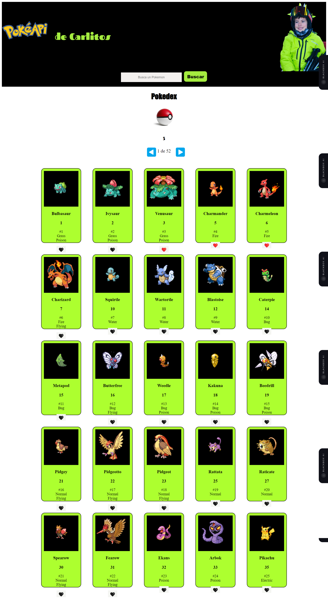

# Carlitos' Pokédex

A fun and interactive Pokédex web application built with React, HTML5, CSS3, JavaScript, and Sass. This app allows my nephew Carlitos to explore his favorite Pokémon and save them in his own virtual Pokéball.

## Features

- Browse and view information about various Pokémon.
- Select and save favorite Pokémon to a virtual Pokéball.
- User-friendly interface designed for kids.
- Responsive layout suitable for different devices.

## Technologies Used 🛠️

-  React: JavaScript library for building user interfaces.
-  Sass: CSS extension language with additional features.
-  HTML5: Markup language for structuring the web page.
-  JavaScript: Programming language for building dynamic websites.
-  CSS3: Styling language for design and presentation.

## Usage Instructions

1. Clone this repository using the command: `git clone https://github.com/yourusername/carlitos-pokedex.git`
2. Navigate to the project directory: `cd react---pokedex`
3. Install the dependencies: `npm install`
4. Start the application: `npm start`
5. Open your web browser and go to `http://localhost:3000` to explore Carlitos' Pokédex.

## How to Save Pokémon

1. Browse through the list of Pokémon.
2. Click on a Pokémon card to view more details.
3. Click the "Save to Pokéball" button to add the Pokémon to Carlitos' virtual Pokéball.

## Customization

Feel free to customize and enhance the Pokédex application for Carlitos:

- Add additional information about each Pokémon.
- Implement a search or filter feature for easier Pokémon discovery.
- Create a mini-game related to Pokémon that Carlitos can enjoy.
- Personalize the design and colors to match Carlitos' preferences.

## Contributions

Contributions are welcome! If you have ideas for improvements or want to contribute in any way, please submit a pull request.

## Author ✒️

- **Carmenyo** - [Carmenyo](https://github.com/Carmenyo)
